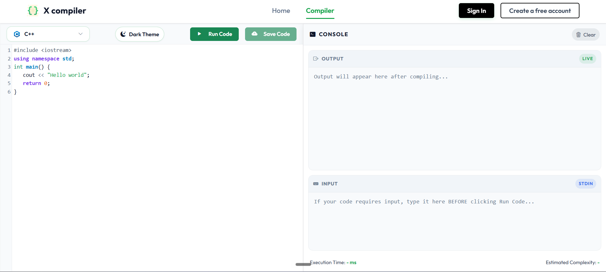
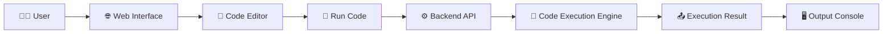
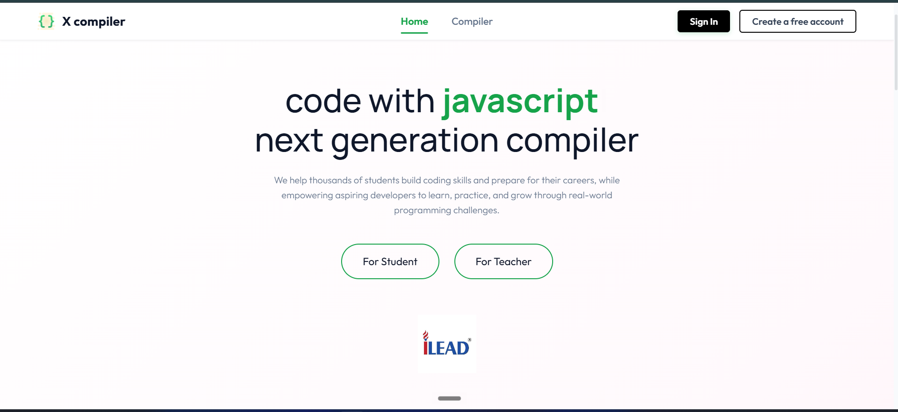
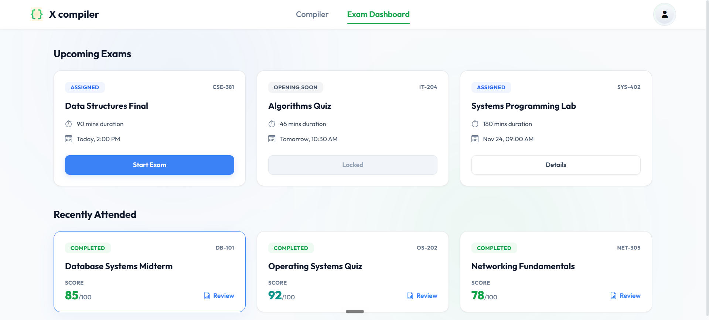
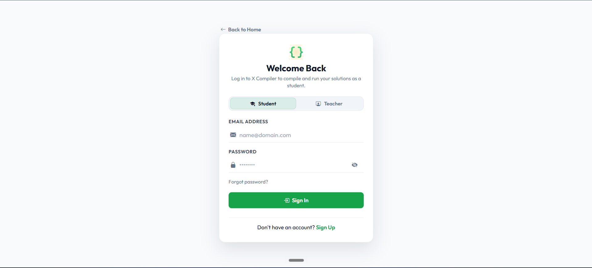
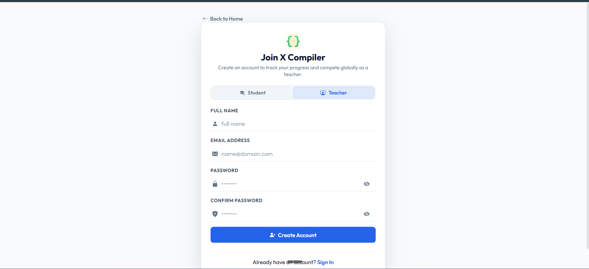

<div align="center">


# X Compiler

</div>

<div align="center">
    
### 🚀 A Modern Online Code Compiler & Learning Platform

Write code. Compile it. Run it. Learn it.

<br>

[](https://github.com/ytsubhadip/X-Compiler)
[](https://developer.mozilla.org/en-US/docs/Web/JavaScript)
[](https://nodejs.org/)
[](https://expressjs.com/)
[](https://developer.mozilla.org/en-US/docs/Web/HTML)
[](https://developer.mozilla.org/en-US/docs/Web/CSS)

<br>

**X-Compiler** is an online coding environment designed to make writing,
executing, and practicing programming easier from the browser.

</div>

---

## 🎯 What is X-Compiler?

**X-Compiler** is a web-based compiler and coding platform where users can write and execute programs directly from their browser without installing a local compiler.

It provides a clean IDE-like experience with:

* 💻 Online code editor
* ▶️ Code execution
* 🌐 Multiple programming languages
* 📝 Coding questions and practice
* 👨‍🎓 Student functionality
* 👨‍🏫 Teacher functionality
* 📤 Program output
* 🔄 Language switching


The goal is simple:

> **Make coding accessible directly from the browser.**

---

# 🖥️ Interface

<div align="center">

### 💻 Online Code Editor




</div>

---

# ✨ Features

<table>
<tr>
<td width="50%">

### 👨‍💻 Developer Features

* ✍️ Powerful code editor
* ▶️ Run code instantly
* 🌐 Multiple language support
* 🔄 Change programming language
* 📋 Input support
* 📤 Output console
* ⚡ API-based execution
* 🎨 Clean developer interface

</td>

<td width="50%">

### 🎓 Learning Features

* 📝 Coding questions
* 🧪 Practice programming
* 👨‍🎓 Student accounts
* 👨‍🏫 Teacher accounts
* 📚 Problem-based learning
* 💡 Learn by writing code
* 📊 Code evaluation
* 🔐 User authentication

</td>
</tr>
</table>

---

# 🧠 How X-Compiler Works



### 🔄 Execution Flow

```text
User
  │
  ▼
Web Browser
  │
  ▼
Code Editor
  │
  │  Source Code
  ▼
Backend API
  │
  ▼
Execution Service
  │
  │  Compile / Execute
  ▼
Program Output
  │
  ▼
Browser Console
```

---

# 🏗️ Architecture

```text
                  ┌──────────────────────┐
                  │      👨‍💻 User         │
                  └──────────┬───────────┘
                             │
                             ▼
                  ┌──────────────────────┐
                  │    🌐 Frontend       │
                  │                      │
                  │ HTML / CSS / JS      │
                  │ CodeMirror Editor    │
                  └──────────┬───────────┘
                             │
                         HTTP Request
                             │
                             ▼
                  ┌──────────────────────┐
                  │    ⚙️ Express API     │
                  │                      │
                  │ Authentication       │
                  │ Code Processing      │
                  │ API Management       │
                  └──────────┬───────────┘
                             │
                             ▼
                  ┌──────────────────────┐
                  │  🚀 Code Execution   │
                  │                      │
                  │ Judge0 / Compiler    │
                  │ Execution Service    │
                  └──────────┬───────────┘
                             │
                             ▼
                  ┌──────────────────────┐
                  │     📤 Output        │
                  └──────────────────────┘
```

---

# 🛠️ Tech Stack

| Technology               | Purpose           |
| ------------------------ | ----------------- |
| 🟨 JavaScript            | Application logic |
| 🟢 Node.js               | Backend runtime   |
| ⚫ Express.js             | Backend API       |
| 🌐 HTML5                 | Web structure     |
| 🎨 CSS3                  | User interface    |
| 📝 CodeMirror            | Code editor       |
| ⚡ Judge0 / Execution API | Code execution    |
| 🔐 Authentication        | User management   |

---

# 📂 Project Structure

A typical project structure looks like:

```text
X-Compiler/
│
├── 📁 public/
│   ├── 📁 css/
│   ├── 📁 js/
│   └── 📁 images/
│
├── 📁 views/
│   ├── index.html
│   ├── login.html
│   ├── signup.html
│   ├── dashboard.html
│   └── compiler.html
│
├── 📁 routes/
│   ├── auth.js
│   ├── compiler.js
│   └── user.js
│
├── 📁 controllers/
│
├── 📁 models/
│
├── 📄 server.js
├── 📄 package.json
├── 📄 package-lock.json
├── 📄 .env
├── 📄 .gitignore
└── 📄 README.md
```


---

# 💻 Example

### Write Code

```javascript
function greet(name) {
    return `Hello, ${name}!`;
}

console.log(greet("X-Compiler"));
```

### Execute

Click:

```text
▶ RUN CODE
```

### Output

```text
Hello, X-Compiler!
```

Simple. Write → Run → Get Result. ⚡

---

# 🌐 Supported Languages

The compiler architecture can support multiple languages through an execution API.

| Language      | Status |
| ------------- | :----: |
| 🟨 JavaScript |    ✅   |
| 🐍 Python     |    ✅   |
| ☕ Java        |    ✅   |
| 🔵 C          |    ✅   |
| 🟦 C++        |    ✅   |
| 🟪 C#         |   🔄   |
| 🐘 PHP        |   🔄   |


---

# 👨‍🎓 Student Mode

Students can use X Compiler as a programming practice environment.

### Student workflow

```text
👨‍🎓 Student
     │
     ▼
🔐 Login
     │
     ▼
📚 Select Problem
     │
     ▼
📝 Write Code
     │
     ▼
▶️ Run
     │
     ▼
📤 View Output
     │
     ▼
✅ Practice & Improve
```

---

# 👨‍🏫 Teacher Mode

Teachers can use the platform to create and manage programming problems for students.

Possible workflow:

```text
👨‍🏫 Teacher
     │
     ▼
🔐 Login
     │
     ▼
📝 Create Question
     │
     ▼
📋 Add Test Cases
     │
     ▼
💾 Publish
     │
     ▼
👨‍🎓 Students Solve
```

---

# 🔐 Authentication

X-Compiler includes user authentication to separate different user experiences.

```text
             🔐 Authentication
                    │
          ┌─────────┴─────────┐
          ▼                   ▼
      👨‍🎓 Student          👨‍🏫 Teacher
          │                   │
          ▼                   ▼
      Dashboard           Dashboard
          │                   │
          ▼                   ▼
    Solve Problems       Create Problems
```

---

# 🎨 UI Highlights

The interface is designed around a modern developer experience.

### Key UI components

```text
┌───────────────────────────────────────────────────────┐
│ ⚡ X-Compiler             Dashboard   Profile   Logout│
├───────────────────────┬───────────────────────────────┤
│                       │                               │
│   📝 CODE EDITOR      |         📤 OUTPUT            |
│                       │                               │
│   1  #include ...     │   Program started...          │
│   2  int main()       │   Hello World!                │
│   3  {                │                               │
│   4      ...          │                               │
│   5  }                │                               │
│                       │                               │
├───────────────────────┴───────────────────────────────┤
│ Language: C++                 ▶ RUN CODE             |
└───────────────────────────────────────────────────────┘
```

---

# 📸 Screenshots


### 🏠 Home Page

<div align="center">



</div>

### 💻 Compiler

<div align="center">


</div>

### 📊 Dashboard

<div align="center">



</div>

### 🔐 Authentication

<div align="center">





</div>

---

# ⚡ Why X-Compiler?

Traditional programming environments often require users to:

```text
Download Compiler
       ↓
Install Dependencies
       ↓
Configure Environment
       ↓
Write Code
       ↓
Compile
       ↓
Fix Configuration Issues 😵
```

X Compiler simplifies this:

```text
Open Browser
     ↓
Write Code
     ↓
▶ Run
     ↓
See Result 🚀
```

### The idea

> **Code should be easy to run anywhere.**

---

# 🔮 Future Roadmap

The project can be expanded with:

* [ ] 🧠 AI-powered code explanation
* [ ] 🤖 AI debugging assistant
* [ ] 🧪 Custom test cases
* [ ] 🏆 Leaderboard
* [ ] 🥇 Coding contests
* [ ] 💬 Discussion system
* [ ] 🔥 Daily coding challenges
* [ ] 📈 Progress tracking
* [ ] 🌙 Dark / Light mode
* [ ] 🧑‍💻 Collaborative coding

---

# 📜 License

# X Compiler — Proprietary License

**Copyright © 2026 X compiler. All Rights Reserved.**

This repository, including its source code, documentation, design, assets, and related materials (collectively, the "Software"), is the exclusive intellectual property of **Subhadip Bar**.

## 1. Permission

No permission is granted to use, copy, modify, merge, publish, distribute, sublicense, sell, or create derivative works from this Software, except with explicit written permission from the copyright holder.

The Software is made publicly available on GitHub for **viewing and evaluation purposes only**.

## 2. Restrictions

Without prior written permission from the copyright holder, you may **not**:

* ❌ Copy the source code or substantial portions of it.
* ❌ Reuse the source code in another project.
* ❌ Modify or create derivative works.
* ❌ Redistribute or republish the source code.
* ❌ Upload the source code to another repository.
* ❌ Use the source code in commercial products or services.
* ❌ Use the source code in academic projects, assignments, or submissions.
* ❌ Claim the Software or any substantial portion of it as your own.
* ❌ Sell, sublicense, or otherwise transfer the Software.
* ❌ Remove or alter copyright or ownership notices.

## 3. Viewing the Repository

You are permitted to view the publicly available repository and its source code on GitHub for personal evaluation and learning purposes.

Viewing the code does **not** grant permission to copy, reuse, modify, distribute, or incorporate the code into another project.

## 4. Third-Party Components

Some dependencies, libraries, frameworks, icons, fonts, or other components used by this project may be distributed under their own licenses.

Those third-party components remain subject to their respective licenses.

This license applies only to the original work created by **Subhadip Bar**.

## 5. Commercial Use

Commercial use of this Software or any substantial portion of its source code is strictly prohibited without prior written permission from the copyright holder.

## 8. Permission Requests

If you would like permission to use, modify, distribute, or incorporate any part of this Software into another project, please contact the copyright holder and obtain **explicit written permission** before doing so.

## 9. Copyright

All rights not expressly granted by this license are reserved.

**Copyright © 2026 X compiler. All Rights Reserved.**

---

### Project

**X Compiler**

Repository:
https://github.com/ytsubhadip/X-Compiler

**Author:** ILEAD

**License:** Proprietary — All Rights Reserved


<br>

⭐ **Star the repository if you find it useful!**

</div>
